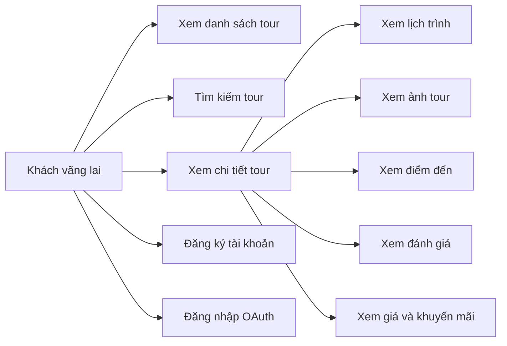
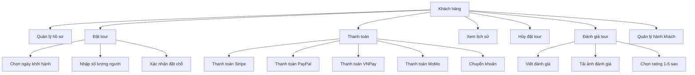
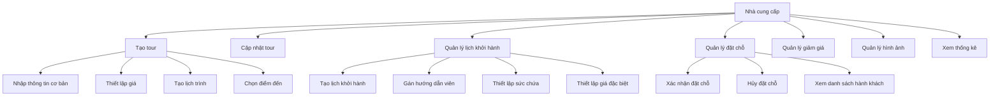
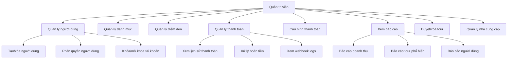

# Sơ đồ Use Case - Hệ thống Đặt Tour Du Lịch (Travia)

## Sơ đồ Use Case tổng quan

```mermaid
graph TB
    subgraph "Hệ thống Đặt Tour Du Lịch"
        %% Use Cases cho Khách vãng lai
        UC1[Xem danh sách tour]
        UC2[Tìm kiếm tour]
        UC3[Xem chi tiết tour]
        UC4[Đăng ký tài khoản]
        UC5[Đăng nhập OAuth]
        
        %% Use Cases cho Khách hàng
        UC6[Quản lý hồ sơ cá nhân]
        UC7[Đặt tour]
        UC8[Thanh toán tour]
        UC9[Xem lịch sử đặt tour]
        UC10[Hủy đặt tour]
        UC11[Đánh giá tour]
        UC12[Quản lý hành khách]
        UC13[Đăng xuất]
        
        %% Use Cases cho Nhà cung cấp
        UC14[Tạo tour mới]
        UC15[Cập nhật tour]
        UC16[Quản lý lịch khởi hành]
        UC17[Quản lý đặt chỗ tour]
        UC18[Quản lý giảm giá]
        UC19[Quản lý hình ảnh tour]
        UC20[Xem thống kê tour]
        
        %% Use Cases cho Quản trị viên
        UC21[Quản lý người dùng]
        UC22[Quản lý danh mục tour]
        UC23[Quản lý điểm đến]
        UC24[Quản lý thanh toán]
        UC25[Quản lý cấu hình thanh toán]
        UC26[Xem báo cáo tổng hợp]
        UC27[Duyệt/xóa tour]
        UC28[Quản lý nhà cung cấp]
    end
    
    %% Actors
    Guest[Khách vãng lai]
    Customer[Khách hàng]
    Supplier[Nhà cung cấp]
    Admin[Quản trị viên]
    
    %% Relationships - Khách vãng lai
    Guest --> UC1
    Guest --> UC2
    Guest --> UC3
    Guest --> UC4
    Guest --> UC5
    
    %% Relationships - Khách hàng
    Customer --> UC1
    Customer --> UC2
    Customer --> UC3
    Customer --> UC6
    Customer --> UC7
    Customer --> UC8
    Customer --> UC9
    Customer --> UC10
    Customer --> UC11
    Customer --> UC12
    Customer --> UC13
    
    %% Relationships - Nhà cung cấp
    Supplier --> UC14
    Supplier --> UC15
    Supplier --> UC16
    Supplier --> UC17
    Supplier --> UC18
    Supplier --> UC19
    Supplier --> UC20
    Supplier --> UC13
    
    %% Relationships - Quản trị viên
    Admin --> UC21
    Admin --> UC22
    Admin --> UC23
    Admin --> UC24
    Admin --> UC25
    Admin --> UC26
    Admin --> UC27
    Admin --> UC28
    Admin --> UC13
    
    style Guest fill:#e1f5ff
    style Customer fill:#c8e6c9
    style Supplier fill:#fff9c4
    style Admin fill:#ffcdd2
```

## Sơ đồ Use Case chi tiết theo từng Actor

### 1. Khách vãng lai (Guest)

### 2. Khách hàng (Customer)

### 3. Nhà cung cấp (Supplier)

### 4. Quản trị viên (Administrator)

## Mô tả chi tiết các Use Case

### Khách vãng lai

1. **Xem danh sách tour**: Xem các tour đang công bố, có thể lọc theo danh mục, điểm đến, giá
2. **Tìm kiếm tour**: Tìm kiếm tour bằng từ khóa (hỗ trợ full-text search tiếng Việt)
3. **Xem chi tiết tour**: Xem thông tin đầy đủ về tour (mô tả, lịch trình, điểm đến, giá, đánh giá)
4. **Đăng ký tài khoản**: Tạo tài khoản mới với email/password
5. **Đăng nhập OAuth**: Đăng nhập qua Google, Facebook, GitHub, Apple

### Khách hàng

1. **Quản lý hồ sơ cá nhân**: Cập nhật thông tin cá nhân, số điện thoại
2. **Đặt tour**: Chọn tour, ngày khởi hành, số lượng người và tạo đặt chỗ
3. **Thanh toán tour**: Thanh toán đặt chỗ qua nhiều phương thức (Stripe, PayPal, VNPay, MoMo, Bank Transfer)
4. **Xem lịch sử đặt tour**: Xem tất cả các tour đã đặt và trạng thái
5. **Hủy đặt tour**: Hủy đặt chỗ đã tạo (nếu chưa thanh toán hoặc đã thanh toán)
6. **Đánh giá tour**: Viết đánh giá, chọn rating 1-5 sao, đính kèm ảnh cho tour đã hoàn thành
7. **Quản lý hành khách**: Thêm/sửa thông tin hành khách trong đặt chỗ

### Nhà cung cấp

1. **Tạo tour mới**: Tạo tour với đầy đủ thông tin (tiêu đề, mô tả, giá, lịch trình, điểm đến, hình ảnh)
2. **Cập nhật tour**: Sửa thông tin tour, thay đổi trạng thái (nháp → công bố → lưu trữ)
3. **Quản lý lịch khởi hành**: Tạo lịch khởi hành cho tour, gán hướng dẫn viên, thiết lập sức chứa
4. **Quản lý đặt chỗ tour**: Xem, xác nhận, hủy các đặt chỗ cho tour của mình
5. **Quản lý giảm giá**: Tạo và quản lý các chương trình giảm giá theo thời gian
6. **Quản lý hình ảnh tour**: Upload, sắp xếp, xóa hình ảnh tour
7. **Xem thống kê tour**: Xem số lượng đặt chỗ, doanh thu của các tour

### Quản trị viên

1. **Quản lý người dùng**: Tạo, sửa, xóa, phân quyền người dùng
2. **Quản lý danh mục tour**: Tạo, sửa, xóa các danh mục tour
3. **Quản lý điểm đến**: Thêm, sửa, xóa điểm đến du lịch
4. **Quản lý thanh toán**: Xem lịch sử thanh toán, xử lý hoàn tiền, xem webhook logs
5. **Quản lý cấu hình thanh toán**: Cấu hình các phương thức thanh toán (Stripe, PayPal, VNPay, MoMo)
6. **Xem báo cáo tổng hợp**: Xem báo cáo doanh thu, tour phổ biến, số lượng người dùng
7. **Duyệt/xóa tour**: Duyệt hoặc xóa tour không phù hợp
8. **Quản lý nhà cung cấp**: Quản lý thông tin các nhà cung cấp tour

## Lưu ý

- Tất cả các actor đều có thể đăng xuất (trừ khách vãng lai)
- Khách hàng phải đăng nhập để đặt tour và thanh toán
- Nhà cung cấp chỉ quản lý được tour của chính mình
- Quản trị viên có quyền cao nhất, có thể quản lý toàn bộ hệ thống

