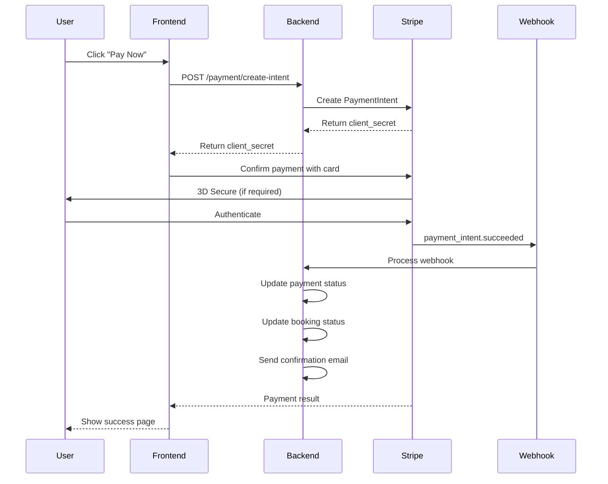

# 💳 Stripe Payment Integration - Travia

## Tổng quan

Stripe payment gateway đã được tích hợp vào Travia để xử lý thanh toán quốc tế cho tour bookings.

## ✨ Features

✅ **International payments** - Visa, Mastercard, Amex  
✅ **135+ currencies** - USD, VND, EUR, JPY, etc.  
✅ **3D Secure 2.0** - Bảo mật cao  
✅ **Webhook events** - Real-time payment status  
✅ **Refund support** - Full & partial refunds  
✅ **Test mode** - Dễ dàng development  

---

## 🚀 Quick Start

### 1. Setup Environment Variables

Thêm vào `env/.env`:

```bash
# Stripe Configuration
STRIPE_SECRET_KEY=sk_test_... # Get from https://dashboard.stripe.com/test/apikeys
STRIPE_PUBLISHABLE_KEY=pk_test_...
STRIPE_WEBHOOK_SECRET=whsec_... # Get after creating webhook
STRIPE_CURRENCY=usd # Default currency
```

### 2. Run Database Migration

```bash
# Apply payment tables migration
psql -U your_user -d travia_db -f db/migration/002_add_payments.sql
```

### 3. Install Stripe CLI (for testing webhooks)

```bash
# macOS
brew install stripe/stripe-cli/stripe

# Login
stripe login

# Forward webhooks to local server
stripe listen --forward-to localhost:8080/api/payment/webhook
```

---

## 📡 API Endpoints

### 1. Get Stripe Config (Public)

```http
GET /api/payment/config
```

**Response:**
```json
{
  "publishable_key": "pk_test_...",
  "currency": "usd"
}
```

**Use case:** Frontend needs publishable key to initialize Stripe.js

---

### 2. Create Payment Intent

```http
POST /api/payment/create-intent
Authorization: Bearer {token}
Content-Type: application/json

{
  "booking_id": 123,
  "amount": 500.00,
  "currency": "usd"
}
```

**Response:**
```json
{
  "payment_intent_id": "pi_xxx",
  "client_secret": "pi_xxx_secret_yyy",
  "amount": 50000,
  "currency": "usd",
  "status": "requires_payment_method"
}
```

---

### 3. Confirm Payment

```http
POST /api/payment/confirm/pi_xxx
Authorization: Bearer {token}
```

**Response:**
```json
{
  "message": "Payment confirmed",
  "payment_intent_id": "pi_xxx",
  "amount": 50000,
  "currency": "usd",
  "status": "succeeded"
}
```

---

### 4. Get Payment Status

```http
GET /api/payment/status/pi_xxx
Authorization: Bearer {token}
```

**Response:**
```json
{
  "payment_intent_id": "pi_xxx",
  "status": "succeeded",
  "amount": 50000,
  "currency": "usd",
  "created": "2025-10-06T10:30:00Z"
}
```

---

### 5. Create Refund (Admin only)

```http
POST /api/payment/refund
Authorization: Bearer {admin_token}
Content-Type: application/json

{
  "payment_id": "pi_xxx",
  "amount": 250.00,
  "reason": "Customer requested cancellation"
}
```

**Response:**
```json
{
  "message": "Refund created successfully",
  "refund_id": "re_xxx",
  "amount": 25000,
  "currency": "usd",
  "status": "succeeded",
  "payment_intent_id": "pi_xxx"
}
```

---

### 6. Webhook Handler

```http
POST /api/payment/webhook
Stripe-Signature: t=xxx,v1=yyy
Content-Type: application/json

{
  "type": "payment_intent.succeeded",
  "data": { ... }
}
```

**Events handled:**
- `payment_intent.succeeded` - Payment thành công
- `payment_intent.payment_failed` - Payment thất bại
- `charge.refunded` - Refund hoàn thành

---

## 💻 Frontend Integration

### React Example with Stripe Elements

```javascript
import { loadStripe } from '@stripe/stripe-js';
import { Elements, CardElement, useStripe, useElements } from '@stripe/react-stripe-js';

// 1. Initialize Stripe
const stripePromise = loadStripe('pk_test_...');

// 2. Create Payment Intent
async function createPayment(bookingId, amount) {
  const response = await fetch('/api/payment/create-intent', {
    method: 'POST',
    headers: {
      'Content-Type': 'application/json',
      'Authorization': `Bearer ${token}`
    },
    body: JSON.stringify({
      booking_id: bookingId,
      amount: amount,
      currency: 'usd'
    })
  });
  
  return await response.json();
}

// 3. Payment Form Component
function CheckoutForm({ bookingId, amount }) {
  const stripe = useStripe();
  const elements = useElements();
  const [loading, setLoading] = useState(false);

  const handleSubmit = async (event) => {
    event.preventDefault();
    setLoading(true);

    // Create payment intent
    const { client_secret } = await createPayment(bookingId, amount);

    // Confirm payment with card
    const { error, paymentIntent } = await stripe.confirmCardPayment(
      client_secret,
      {
        payment_method: {
          card: elements.getElement(CardElement),
        }
      }
    );

    if (error) {
      console.error('Payment failed:', error.message);
      alert(`Payment failed: ${error.message}`);
    } else if (paymentIntent.status === 'succeeded') {
      console.log('Payment succeeded!');
      // Redirect to success page
      window.location.href = '/booking/success';
    }

    setLoading(false);
  };

  return (
    <form onSubmit={handleSubmit}>
      <CardElement />
      <button type="submit" disabled={!stripe || loading}>
        {loading ? 'Processing...' : 'Pay Now'}
      </button>
    </form>
  );
}

// 4. Main Component
function PaymentPage() {
  return (
    <Elements stripe={stripePromise}>
      <CheckoutForm bookingId={123} amount={500} />
    </Elements>
  );
}
```

---

## 🧪 Testing

### Test Cards

Stripe provides test cards for different scenarios:

| Card Number | Scenario |
|-------------|----------|
| `4242 4242 4242 4242` | Success |
| `4000 0025 0000 3155` | Requires 3D Secure |
| `4000 0000 0000 9995` | Declined - Insufficient funds |
| `4000 0000 0000 0069` | Expired card |

**Other test data:**
- **Expiry:** Any future date (e.g., 12/34)
- **CVC:** Any 3 digits (e.g., 123)
- **ZIP:** Any valid ZIP code

### Test with Stripe CLI

```bash
# Start webhook forwarding
stripe listen --forward-to localhost:8080/api/payment/webhook

# Trigger test events
stripe trigger payment_intent.succeeded
stripe trigger payment_intent.payment_failed
stripe trigger charge.refunded
```

---

## 💰 Pricing

### Stripe Transaction Fees

| Region | Fee |
|--------|-----|
| **Vietnam local cards** | 3.9% + 30¢ |
| **International cards** | 3.9% + 30¢ |
| **Currency conversion** | +1% |

### Example calculation:

```
Tour price: $500 USD
Stripe fee: $500 × 3.9% + $0.30 = $19.80
Net received: $480.20

If converting to VND:
$480.20 × exchange rate (e.g., 24,000) = 11,524,800 VND
Currency conversion fee: 1% = 115,248 VND
Final: 11,409,552 VND
```

---

## 🔒 Security Best Practices

### ✅ Implemented:

1. **Never store card numbers** - Stripe handles all sensitive data
2. **Use HTTPS** - All API calls must be over HTTPS
3. **Webhook signature verification** - Prevent fake webhooks
4. **Environment variables** - Never commit API keys
5. **Payment intent pattern** - Secure flow

### ⚠️ Important:

```bash
# NEVER commit these to Git:
STRIPE_SECRET_KEY=sk_live_...
STRIPE_WEBHOOK_SECRET=whsec_...

# Add to .gitignore:
env/.env
.env
```

---

## 🔄 Payment Flow



---

## 📊 Database Schema

### `thanh_toan` table

| Column | Type | Description |
|--------|------|-------------|
| `id` | UUID | Primary key |
| `dat_cho_id` | INT | Booking ID |
| `nguoi_dung_id` | UUID | User ID |
| `so_tien` | DECIMAL | Amount |
| `don_vi_tien_te` | VARCHAR | Currency (USD, VND, etc.) |
| `phuong_thuc` | ENUM | Payment method |
| `trang_thai` | ENUM | Status (pending, completed, etc.) |
| `stripe_payment_intent_id` | VARCHAR | Stripe PaymentIntent ID |
| `card_last4` | VARCHAR | Last 4 digits of card |
| `ngay_thanh_toan` | TIMESTAMP | Payment date |

---

## 🐛 Troubleshooting

### Issue: "No such payment_intent"

**Solution:** Payment intent may have expired (24 hours). Create a new one.

### Issue: "Webhook signature verification failed"

**Solution:** 
1. Check `STRIPE_WEBHOOK_SECRET` is correct
2. Use Stripe CLI for local testing
3. In production, create webhook in Stripe Dashboard

### Issue: "Insufficient funds"

**Solution:** This is expected for test card `4000 0000 0000 9995`. Use success card `4242 4242 4242 4242`.

---

## 📚 Additional Resources

- **Stripe Dashboard:** https://dashboard.stripe.com/
- **Stripe Documentation:** https://stripe.com/docs
- **Stripe API Reference:** https://stripe.com/docs/api
- **Stripe Testing:** https://stripe.com/docs/testing
- **Stripe Webhooks:** https://stripe.com/docs/webhooks

---

## 🎯 Next Steps

### Phase 1 (Current):
- [x] Basic payment flow
- [x] Webhook handling
- [x] Refund support

### Phase 2 (Future):
- [ ] Add VNPay for Vietnamese customers
- [ ] Subscription/recurring payments
- [ ] Installment plans
- [ ] Multi-currency pricing
- [ ] Payment analytics dashboard

---

**Created:** October 2025  
**Status:** ✅ Production Ready  
**Version:** 1.0

